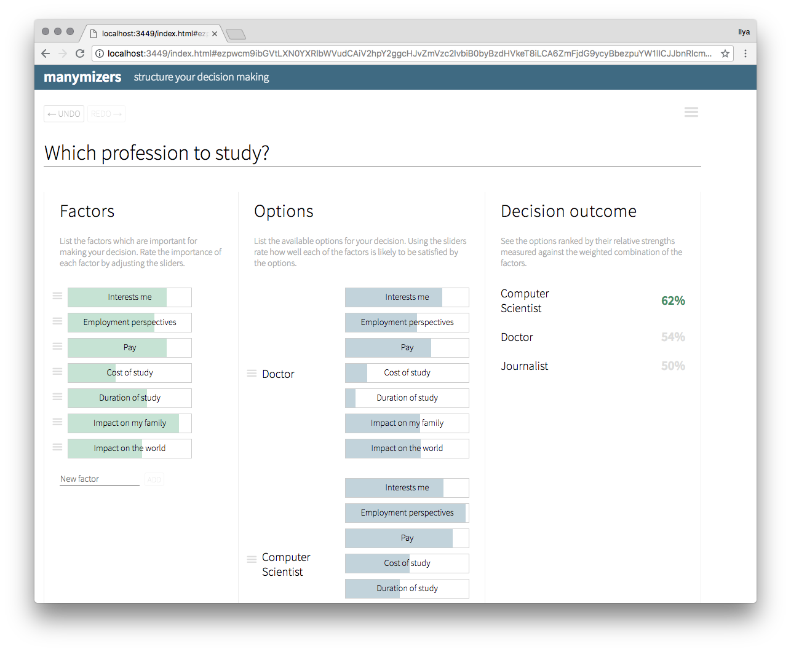

# Manymizers

This is an experimental tool for helping to structure decision making
inspired by the original version of [ChoiceMap](https://choicemap.co/). 




### Development mode

To start the Figwheel compiler, navigate to the project folder and run the following command in the terminal:

```
lein figwheel
```

Figwheel will automatically push cljs changes to the browser.
Once Figwheel starts up, you should be able to open the `public/index.html` page in the browser.


### Building for production

```
lein clean
lein package
```
